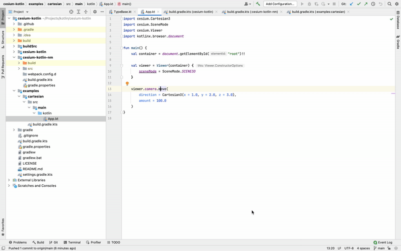

[](https://github.com/turansky/cesium-kotlin/actions)
[](https://mvnrepository.com/artifact/com.github.turansky.cesium/cesium-kotlin)
[](http://kotlinlang.org)
[](https://kotl.in/jsirsupported)

# Kotlin/JS support for [Cesium](https://github.com/CesiumGS/cesium)

## 🚀 Get Started

Add `cesium-kotlin` dependency:

```kotlin
dependencies {
    implementation("com.github.turansky.cesium:cesium-kotlin:1.80.0-15")
}
```

## 👷 Features

* 🔧 Fixed inheritance
    * Missed in TypeScript
    * In progress
* 🧐 Numberability
    * `Int`/`Double` instead of `Number`
    * In progress
* 💡 KDoc

## 🌐 Online documentation links



## 🏗 Generation

* Run `./gradlew build`
* Check folder `cesium-kotlin/src/main/kotlin`
